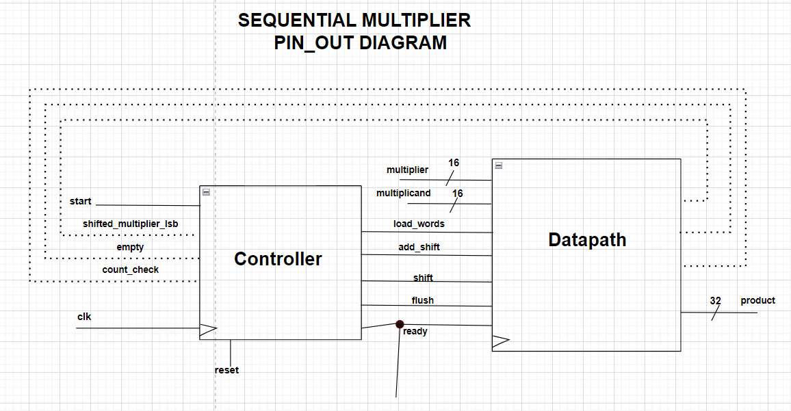
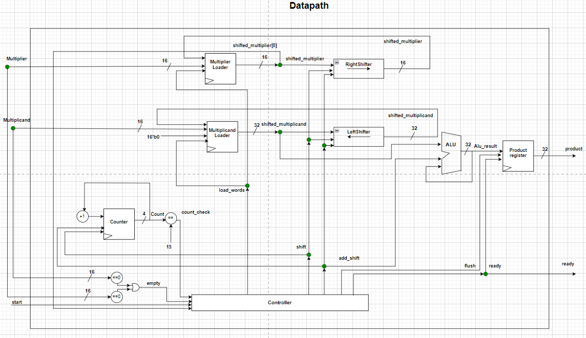
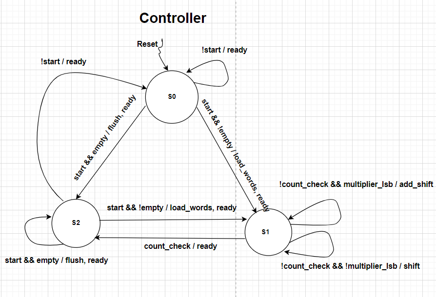

# 16-Bit Sequential Multiplier

This repository contains Verilog code for a 16-bit sequential multiplier designed to multiply two 16-bit numbers and generate a 32-bit product. The multiplier employs a basic binary multiplication algorithm, performing addition and shifting operations sequentially under the control of a finite state machine implemented in the `Controller` module.

## Table of Contents
- [16-Bit Sequential Multiplier](#16-bit-sequential-multiplier)
  - [Overview](#overview)
  - [Diagrams](#diagrams)
  - [Verilog Modules](#verilog-modules)
  - [Operation](#operation)
  - [Simulation](#simulation)
    - [VSIM](#Vsim)
    - [Verilator](#verilator)
  - [Cleaning up](#cleaning-up)
  - [Dependencies](#dependencies)
  - [License](#license)

## Overview

The Verilog implementation consists of the following modules:
- **`TopModule`:** The top-level module instantiates the `Datapath` and `Controller` modules, managing data flow between them.
- **`Datapath`:** Contains the main arithmetic logic, incorporating sub-modules for addition (`AddModule`), shifting (`ShiftModule`), and multiplexing (`MuxModule`).
- **`AddModule`:** Performs addition operations.
- **`ShiftModule`:** Handles shifting operations essential for the multiplication process.
- **`MuxModule`:** Implements a multiplexer selecting one of two inputs based on a control signal.
- **`Controller`:** Manages the state machine that controls the overall multiplication process.


## Diagrams


*Figure 1: Pinout Diagram*


*Figure 2: Datapath Diagram*

  
*Figure 3: Controller Diagram*

## Verilog Modules

### `TopModule`
The top-level module orchestrates the operation, instantiating sub-modules and managing data flow.

### `Datapath`
The central arithmetic logic module, incorporating sub-modules for addition, shifting, and multiplexing.

### `AddModule`
Responsible for addition operations, combining the multiplicand and accumulator under control signals from the controller.

### `ShiftModule`
Handles shifting operations for both the accumulator and multiplier, controlled by the controller.

### `MuxModule`
Implements a multiplexer to select either the multiplicand or zeros based on a control signal from the controller.

### `Controller`
Manages the finite state machine to control the sequential multiplier's operation, orchestrating addition, shifting, and multiplexing.

## Operation

The sequential multiplier follows a basic binary multiplication algorithm:
1. The controller checks the least significant bit (LSB) of the multiplier.
2. Based on the LSB, signals are sent to the Mux, Adder, and Shifter to perform addition, selection, and shifting operations.
3. The selected output from the Mux is added to the accumulator, and the result is stored back in the accumulator.
4. Shifting is then performed on the carry, accumulator, and multiplier.
5. Steps 1-4 are repeated for 16 iterations, covering all bits of the multiplier.

## Simulation

### VSIM

To run the simulation using VSIM, execute the following command:

```bash
make sim TOOL=vsim
```

### Verilator

To run the simulation using Verilator, execute the following command:

```bash
make sim TOOL=verilator
```

### Cleaning Up

To remove generated files, execute:

```bash
make clean
```

## Dependencies

Ensure the following dependencies are installed:
- VSIM (for VSIM simulation)
- Verilator (for Verilator simulation)
- GTKWave (for viewing Verilator waveform)

## Licencse

This code is provided under the MIT License. Feel free to customize and use it for your projects!
